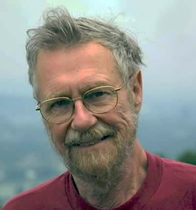

# Limbajul propozițiilor

## Ce fel de afirmații putem face in Logica Hoare?

Pre-condiția și post-condiția se construiesc din:

- variabilele programului \texttt{M, N , Sum} din $L$

- numere $42, 13, 7, 3$

- __variabile logice__ $x, y, z, t$

- operații aritmetice $+, -, *$

- relații aritmetice $\leq, =$

- logică propozițională $\textbf{true}, \textbf{false}, \neg, \wedge, \vee$

- cuantificatori $\forall, \exists$

## Expresii aritmetice extinse

Fixăm o mulţime $V$, ale cărei elemente vor fi numite **variabile
logice**, care vor avea oarecum acelaşi rol ca variabilele din logica de
ordinul I (altul decât cel al variabilelor din IMP, numite şi
**variabile de program**, care reprezentau locuri în memorie, ca în
limbajele imperative uzuale).

O **expresie aritmetică extinsă** va avea exact una dintre următoarele
forme:

-   un număr întreg $n$;

-   o variabilă de program $X$ (element al lui $L$);

-   o variabilă logică $x$ (element al lui $V$);

-   $a_0+a_1$, $a_0-a_1$, $a_0*a_1$, unde $a_0$ şi $a_1$ sunt expresii
    aritmetice extinse.

## Expresii booleene extinse (aserţiuni)

O **expresie booleană extinsă**, numită şi **aserţiune**, va avea exact
una dintre următoarele forme:

-   o valoare booleană (**true** sau **false**);

-   $a_0=a_1$, $a_0 \leq a_1$, unde $a_0$ şi $a_1$ sunt expresii
    aritmetice extinse;

-   $\neg A_0$, $A_0 \land A_1$, $A_0 \lor A_1$, unde $A_0$ şi $A_1$
    sunt aserţiuni;

-   $\forall x A$, unde $x \in V$ şi $A$ este o aserţiune.

Considerăm cunoscută prescurtările $A \to B$ pentru $(\neg A) \lor B$, $\exists x A$ pentru $\neg \forall x \neg A$

## Substituţia

Putem defini în modul absolut natural substituţiile de forma $A[x:=a]$
sau $A[X:=a]$, unde $A$ este o aserţiune, $X \in L$, $x \in V$, iar $a$
este o expresie aritmetică -- nu extinsă: de aceea, nu trebuie să ne
preocupăm de redenumiri de variabile logice (cum o facem la logica de
ordinul I). Enunţăm doar clauza:
$$(\forall z A)[x:=a] := \begin{cases} \forall z A, & \mbox{dac\u a } z=x, \\
\forall z (A[x:=a]), & \mbox{altfel}.\end{cases}$$

## Evaluarea expresiilor aritmetice extinse

Vom numi **interpretare** o funcţie de la $V$ la $\mathbb{Z}$. Pentru
orice $\sigma \in \Sigma$ şi orice interpretare $I : V \to \mathbb{Z}$,
definim o funcţie $|\cdot|^I_\sigma$ care evaluează expresii aritmetice
extinse în numere întregi, în mod recursiv, în felul următor:

-   pentru orice $N \in \mathbb{Z}$, $|N|^I_\sigma:=N$;
-   pentru orice $X \in L$, $|X|^I_\sigma:=\sigma(X)$;
-   pentru orice $x \in V$, $|x|^I_\sigma:=I(x)$;
-   pentru orice expresii aritmetice extinse $a_0$, $a_1$, avem\
    $|a_0+a_1|^I_\sigma:=|a_0|^I_\sigma+|a_1|^I_\sigma$,
    $|a_0-a_1|^I_\sigma:=|a_0|^I_\sigma-|a_1|^I_\sigma$,
    $|a_0*a_1|^I_\sigma:=|a_0|^I_\sigma*|a_1|^I_\sigma$.

Avem că, pentru orice expresie aritmetică (ne-extinsă) $a$,
$|a|^I_\sigma=n$ dacă și numai dacă $\bs{\cfg{a, \sigma}}{n}$.

Analog cu cele anterioare, pentru orice $I : V \to \mathbb{Z}$,
$x \in V$ şi $N \in \mathbb{Z}$, definim interpretarea
$I_{x \mapsto N}$, pentru orice $y \in V$, prin:
$$I_{x \mapsto N}(y) := \begin{cases} N, & \mbox{dac\u a } y=x, \\
I(y), & \mbox{altfel}.\end{cases}$$

## Evaluarea aserţiunilor

Definim acum, pentru $\sigma \in \Sigma$, $I : V \to \mathbb{Z}$ şi $A$
aserţiune, relaţia $\sigma \models^I A$, în mod recursiv, în felul
următor:

-   $\sigma \models^I \textbf{true}$,
    $\sigma \not\models^I \textbf{false}$;
-   pentru orice expresii aritmetice extinse $a_0$, $a_1$, avem\
    $\sigma \models^I a_0=a_1$ dacă şi numai dacă
    $|a_0|^I_\sigma=|a_1|^I_\sigma$,\
    $\sigma \models^I a_0\leq a_1$ dacă şi numai dacă
    $|a_0|^I_\sigma\leq|a_1|^I_\sigma$;
-   pentru orice aserţiuni $A_0$, $A_1$, avem\
    $\sigma \models^I \neg A_0$ dacă şi numai dacă
    $\sigma \not\models^I  A_0$,\
    $\sigma \models^I A_0 \land A_1$ dacă şi numai dacă
    $\sigma \models^I  A_0$ şi $\sigma \models^I  A_1$,\
    $\sigma \models^I A_0 \lor A_1$ dacă şi numai dacă
    $\sigma \models^I  A_0$ sau $\sigma \models^I  A_1$;
-   pentru orice $x \in V$ şi orice aserţiune $A$, avem\
    $\sigma \models^I \forall x A$ dacă şi numai dacă, pentru orice
    $N \in \mathbb{Z}$, $\sigma \models^{I_{x \mapsto N}}  A$.

Avem că, pentru orice expresie booleană (ne-extinsă) $b$, $\sigma \models^I b$ dacă
şi numai dacă $\bs{\cfg{b, \sigma}}{\cfg{\textbf{true}}}$. Notăm cu
$\models A$ faptul că, pentru orice $\sigma$ şi $I$,
$\sigma \models^I A$. Notăm şi
$A^I:=\{\sigma \in \Sigma \mid \sigma \models^I A\}$.

## Semantica enunţurilor Hoare (folosind semantica big-step)

Fie $\hoare{A}c{B}$ un enunț Hoare, unde $A$ şi $B$ sunt aserţiuni, iar $c$ este o instrucţiune.

Definim semantica acestora în felul următor:

-   pentru orice $\sigma$ şi $I$, $\sigma \models^I \{A\}c\{B\}$ dacă
    $\sigma \models^I A$ implică faptul că, pentru orice $\sigma'$ cu
    $\bs{\cfg{c, \sigma}}{\cfg{\sigma'}}$,
    $\sigma' \models^I B$;

-   pentru orice $I$, $\models^I \{A\}c\{B\}$ dacă, pentru orice
    $\sigma$, $\sigma \models^I \{A\}c\{B\}$, sau, echivalent, pentru
    orice $\bs{\cfg{c, \sigma}}{\cfg{\sigma'}}$,
    $\sigma \models^I A$ implică $\sigma' \models^I B$;

-   $\models \{A\}c\{B\}$ dacă, pentru orice $I$,
    $\models^I \{A\}c\{B\}$.

## Logica Hoare

- $\reg[Skip]{\Hoare{Q}{skip}{Q}}{}{}$

- $\reg[Atribuire]{\Hoare{Q[x := e]}{x:=e}{Q}}{}{}$

- $\reg[Întărire pre]{\Hoare{P_s}{S}{Q}}{\Hoare{P_w}{S}{Q}}{{}\models P_s \to P_w}$

- $\reg[Slăbire post]{\Hoare{P}{S}{Q_w}}{\Hoare{P}{S}{Q_s}}{{}\models Q_s \to Q_w}$

- $\reg[Secvențiere]{\Hoare{P}{S_1 ; S_2}{R}}{\Hoare{P}{S_1}{Q} \qquad  \Hoare{Q}{S_2}{R}}{}$

- $\reg[If]{\Hoare{P}{if\ b\ then\ S_1\ else\  S_2}{Q}}{\Hoare{P \wedge b}{S_1}{Q} \qquad \Hoare{P \wedge \neg b}{S_2}{Q}}{}$

- $\reg[While]{\Hoare{P}{while\ b\ do\ S}{P\wedge \neg b}}{\Hoare{P \wedge b}{S}{P}}{}$

Notăm $\mathbf{\vdash \Hoare{P}{c}{Q}}$ dacă $\Hoare{P}{c}{Q}$ aparține mulțimii definite de aceste reguli.

## Teorema de corectitudine

### Teorema de corectitudine
Pentru orice $A$, $B$, $c$ cu
$\vdash \{A\}c\{B\}$, avem $\models \{A\}c\{B\}$.

### Demonstraţie (inducție după regulile Hoare, pe sărite)
$\reg[Atribuire]{\Hoare{Q[x := e]}{x:=e}{Q}}{}{}$

Fie $\sigma, I$ astfel incât $\sigma \models^I Q[x := e]$ și $\sigma'$ astfel încât
$\bs{\cfg{\mathtt{x := e}, \sigma}}{\cfg{\sigma'}}$.
Atunci există $n$ astfel încât $\bs{\cfg{e, \sigma}}{\cfg{n}}$ și $\sigma' = \sigma[x := n]$.

Avem că $|e|^I_\sigma=n$ și se poate demonstra prin inducție asupra lui $Q$ că
$\sigma \models^I Q[x := e]$ implică $\sigma' \models^I Q$.

$\reg[Secvențiere]{\Hoare{P}{S_1 ; S_2}{R}}{\Hoare{P}{S_1}{Q} \qquad  \Hoare{Q}{S_2}{R}}{}$

Presupunem ipoteza adevărată pentru $\hoare{P}{S_1}{Q}$ și $\hoare{Q}{S_2}{R}$.
Fie $\sigma, I$ astfel încât $\sigma \models^I P$ și $\sigma'$ astfel încât
$\bs{\cfg{\mathtt{S_1 ; S_2}, \sigma}}{\cfg{\sigma'}}$.
Atunci există $\sigma''$ astfel încât $\bs{\cfg{\mathtt{S_1}, \sigma}}{\cfg{\sigma''}}$
și  $\bs{\cfg{\mathtt{S_2}, \sigma''}}{\cfg{\sigma'}}$.

Din ipoteza de inducție pentru $\hoare{P}{S_1}{Q}$ avem că $\sigma'' \models^I Q$.

Din ipoteza de inducție pentru $\hoare{Q}{S_2}{R}$ avem că $\sigma' \models^I R$.

## Teorema de corectitudine

### Teorema de corectitudine
Pentru orice $A$, $B$, $c$ cu
$\vdash \{A\}c\{B\}$, avem $\models \{A\}c\{B\}$.

### Demonstraţie (cont.)

$\reg[While]{\Hoare{A}{\Swhile b \Sdo S}{A\wedge \neg b}}{\Hoare{A \wedge b}{S}{A}}{}$

Notăm $w:=\Swhile b \Sdo S$.
Presupunem $\models \{A \land b\}S\{A\}$ (ip. inducție).

Fie $I : V \to \mathbb{Z}$. Demonstrăm că pentru orice $\sigma, \sigma'$ astfel încât
$\bs{\cfg{w, \sigma}}{\cfg{\sigma'}}$,  $\sigma \models^I A$ implică $\sigma' \models^I A \land\neg b$ prin inducție după regulile big-step.

Dacă $\reg[While-false]{\bs{\cfg{w,\sigma}}{\sigma}}{\bs{\cfg{b, \sigma}}{\cfg{\Sfalse}}}{}$:

Avem $\sigma' = \sigma$ și deducem $\sigma \not\models^I b$, deci $\sigma \models^I \neg b$, deci $\sigma \models^I A \land \neg b$.

Dacă $\reg[While-true]{\bs{\cfg{w,\sigma}}{\sigma'}}{\bs{\cfg{b, \sigma}}{\cfg{\Strue}} \qquad \bs{\cfg{S, \sigma}}{\cfg{\sigma''}} \qquad \bs{\cfg{w, \sigma''}}{\cfg{\sigma'}}}{}$:

Putem presupune ipoteza de inducție pentru $\bs{\cfg{w, \sigma''}}{\cfg{\sigma'}}$, adică,
dacă $\sigma'' \models^I A$, atunci $\sigma' \models^I A \land\neg b$ .

Deoarece $\bs{\cfg{b, \sigma}}{\cfg{\Strue}}$, avem $\sigma \models^I b$, deci $\sigma \models^I A \land b$, și deoarece  $\models \{A \land b\}S\{A\}$ și $\bs{\cfg{S, \sigma}}{\cfg{\sigma''}}$,
înseamnă că $\sigma'' \models^I A$, deci $\sigma' \models^I A \land\neg b$.

# Cea mai slabă precondiție

## Edsger W. Dijkstra

\hfill { width=30% } \hfill $\ $

- A inventat în 1956 un algoritm de determinare a celor mai scurte drumuri într-un graf
- A inventat în ~1962 noțiunea de _semafoare_ pentru sincronizarea accesului la resurse în programarea concurentă
- A câștigat premiul Turing în 1972 pentru sustinerea programării structurate
- A introdus în 1975 __calculul celei mai slabe precondiții__ ca o tehnică alternativă pentru verificarea corectitudinii programelor imperative

## Calculul celei mai slabe pre-condiții

### Logica Hoare ne prezintă probleme logice

- Dată fiind o pre-condiție $P$, codul \texttt{S}, și post-condiția $Q$,
- este adevărat că $\Hoare{P}{S}{Q}$?

### Calculul celei mai slabe pre-condiții descrie o __funcție__

- Dat fiind codul \texttt{S} și post-condiția $Q$
- găsiți acel $P$ care este _cea mai slabă pre-condiție_ pentru \texttt{S} și $Q$.

## Cea mai slabă precondiţie (semantică)

Pentru orice instrucţiune $c$, orice aserţiune $B$ şi orice interpretare
$I$, definim **cea mai slabă precondiţie liberală[^1]** (**semantică**) a lor prin

_mulțimea stărilor inițiale pentru care, după execuția lui $c$, $B$ e adevărată_

$$wls^I(c,B):=\{\sigma \in \Sigma \mid \text{pentru orice $\sigma' \in \Sigma$ cu $\bs{\cfg{c, \sigma}}{\cfg{\sigma'}}$, $\sigma' \models^I B$}\}.$$

Avem că, pentru orice $A$, $B$, $c$, $I$, $\models^I \{A\}c\{B\}$ dacă
şi numai dacă $A^I \subseteq wls^I(c,B)$ (exerciţiu!).

Am vrea să __capturăm__ această mulțime ca o aserțiune $W$, adică să găsim
$W$ astfel încât $W^I = wls^I(c, B)$, pentru orice $I$.

[^1]: Liberală, în sensul că acceptă ideea de neterminare.

## Definirea celei mai slabe precondiţii (wp)

Vom avea: $$\begin{aligned}
wp(\textbf{skip},B) &:=B \\
wp(X:=a, B) &:= B[X:=a] \\
wp(c_0;c_1, B) &:= wp(c_0, wp(c_1,B)) \\
wp(\textbf{if $b$ then $c_0$ else $c_1$},B) &:= (b \land wp(c_0,B)) \lor (\neg b \land wp(c_1,B)).
\end{aligned}$$

Pentru __while__, notăm $w:=\Swhile b \Sdo c$ și folosind că $w \sim \Sif b \Sthen (c; w) \Selse {\Sskip}$, trebuie ca

$$\begin{aligned}
wp(w, B) & = wp(\Sif b \Sthen (c; w) \Selse {\Sskip},B) \\
          & = (b \land wp(c; w,B)) \lor (\neg b \land wp(\Sskip,B)) \\
          & = (b \land wp(c, wp(w,B))) \lor (\neg b \land B)
\end{aligned}$$

## Definirea celei mai slabe precondiţii (while)

Vrem ca $wp(w, B) = (b \land wp(c, wp(w,B))) \lor (\neg b \land B)$

Definim șirul de aserțiuni $\left(P_k\right)_{k \in N}$ recursiv astfel:

- $P_0 := \neg b \land B$
- $P_{k+1} := b \land wp(c,P_k)$

Presupunem că avem dijuncții infinitare în limbaj și definim

$$\displaystyle wp(w,B) := \bigvee_{k \in \mathbb{N}} P_k.$$

__Intuiție:__ Dacă $\sigma \models^I  wp(w, B)$, atunci

-  există un $k$ astfel încât $\sigma \models^I P_k$, deci
- execuția lui $w$ din starea $\sigma$ se va opri după $k$ iterații și
- $B$ va fi adevărată în starea finală.

## Presupuneri Suplimentare (semantice)

Formula pentru while capturează ideea de terminare.

Definim deci, **cea mai slabă precondiţie semantică** pentru instrucțiunea $c$ față de
post-condiția $B$ în interpretarea $I$ ca:

_mulțimea stărilor inițiale pentru care execuția lui $c$ se termină și $B$ e adevărată în starea de după_
$$ws^I(c,B):=\{\sigma \in \Sigma \mid \text{există $\sigma' \in \Sigma$ astfel încât $\bs{\cfg{c, \sigma}}{\cfg{\sigma'}}$ și $\sigma' \models^I B$}\}.$$

Avem că $ws^I(c, B) \subseteq wls^I(c, B)$ ($wls^I(c, B)$ include și stările pentru care execuția nu se termină).

__Observație:__ dacă execuția lui $c$ se termină _în orice stare_, atunci $ws^I(c, B) = wls^I(c, B)$
(exercițiu!)

## Teoremă
$\displaystyle wp(c,B)^I=ws^I(c,B)$

### Demonstraţie (inducție după regulile de definire ale lui $wp$)
Tratăm doar cazul pentru $w = \Swhile b \Sdo S$. Din ipoteza de inducție,
presupunem că (1) pentru orice $B$, $wp(S,B)^I=ws^I(S,B)$

Pentru $\subseteq$", fie $\sigma$ cu
$\sigma \models^I \bigvee_{k \in \mathbb{N}} P_k$, deci există
$k \in \mathbb{N}$ cu $\sigma \models^I P_k$. Facem inducţie după $k$.

Pentru $k=0$, avem $\sigma \models^I \neg b \land B$, deci (2) $\sigma \models^I \neg b$ și (3) $\sigma \models^I B$.
Din (2), $\bs{\cfg{b, \sigma}}{\cfg{\Sfalse}}$. Atunci $\bs{\cfg{w, \sigma}}{\cfg{\sigma}}$ și concluzia e demonstrată datorită lui (3).

Pentru pasul de inducţie, presupunem
$\sigma \models^I b \land wp(c,P_k)$, deci (2) $\sigma \models^I b$ și (3) $\sigma \models^I wp(c,P_k)$.
Din (2) $\bs{\cfg{b, \sigma}}{\cfg{\Strue}}$. Din (1) și (3), $\sigma \in ws^I(S, P_k)$, deci
există $\sigma''$ astfel încăt (4) $\bs{\cfg{S, \sigma}}{\cfg{\sigma''}}$ și $\sigma'' \models^I P_k$.
Din ipoteza de inducție pentru $k$, există $\sigma'$ astfel încât
(5) $\bs{\cfg{w, \sigma''}}{\cfg{\sigma'}}$ și (6) $\sigma' \models^I B$.
Din (2), (4) și (5) rezultă că $\bs{\cfg{w, \sigma}}{\cfg{\sigma'}}$ și folosind (6), că
$\sigma \in ws^I(w, B)$.

## Lemă ajutătoare

Dacă $\bs{\cfg{w, \sigma}}{\cfg{\sigma'}}$ atunci există
$n \geq 0$ şi un şir finit de stări $(\sigma_i)_{i \leq n}$ cu
$\sigma_0 = \sigma$, $\sigma_n = \sigma'$,
$\bs{\cfg{b, \sigma_n}}{\cfg{\Sfalse}}$ şi, pentru orice $i$ cu
$0 \leq i < n$, $\bs{\cfg{b, \sigma_i}}{\cfg{\Strue}}$ şi
$\bs{\cfg{S, \sigma_i}}{\cfg{\sigma_{i+1}}}$.

### Demonstrație (inducție după regulile big-step)

Dacă $\reg[While-false]{\bs{\cfg{w,\sigma}}{\sigma}}{\bs{\cfg{b, \sigma}}{\cfg{\Sfalse}}}{}$

Alegem $n = 0$ și avem $\bs{\cfg{b, \sigma_0}}{\cfg{\Sfalse}}$.

Dacă $\reg[While-true]{\bs{\cfg{w,\sigma}}{\sigma'}}{\bs{\cfg{b, \sigma}}{\cfg{\Strue}} \qquad \bs{\cfg{S, \sigma}}{\cfg{\sigma''}} \qquad \bs{\cfg{w, \sigma''}}{\cfg{\sigma'}}}{}$:

Din ipoteza de inducție pentru $\bs{\cfg{w, \sigma''}}{\cfg{\sigma'}}$ există
$n' \geq 0$ şi un şir finit de stări $(\sigma'_i)_{i \leq n'}$ cu
$\sigma'_0 = \sigma''$, $\sigma'_{n'} = \sigma'$,
$\bs{\cfg{b, \sigma'_{n'}}}{\cfg{\Sfalse}}$ şi, pentru orice $i$ cu
$0 \leq i < n'$, $\bs{\cfg{b, \sigma'_i}}{\cfg{\Strue}}$ şi
$\bs{\cfg{S, \sigma'_i}}{\cfg{\sigma'_{i+1}}}$.

Definim $n = n' +1$ și $\sigma_0 = \sigma$, $\sigma_{i+1} = \sigma'_i$ pentru $0 \leq i \leq n$.
Se verifică că $\bs{\cfg{b, \sigma_0}}{\cfg{\Strue}}$ şi
$\bs{\cfg{S, \sigma_0}}{\cfg{\sigma_1}}$

## Teoremă

Fie $I$ o interpretare. pentru orice $c$, $B$, Atunci $wp(c,B)^I=ws^I(c,B)$.

::: block
### Demonstraţie (cont.)
Pentru $\supseteq$", fie $\sigma \in ws^I(w,B)$. Deci există
$\sigma'$ astfel încât $\bs{\cfg{w, \sigma}}{\cfg{\sigma'}}$ și $\sigma' \models^I B$.

Aplicând lema ajutătoare, fie $n \geq 0$ şi un şir finit de stări $(\sigma_i)_{i \leq n}$ cu
$\sigma_0 = \sigma$, $\sigma_n = \sigma'$,
$\bs{\cfg{b, \sigma_n}}{\cfg{\Sfalse}}$ şi, pentru orice $i$ cu
$0 \leq i < n$, $\bs{\cfg{b, \sigma_i}}{\cfg{\Strue}}$ şi
$\bs{\cfg{S, \sigma_i}}{\cfg{\sigma_{i+1}}}$.

Se arată, apoi, că, pentru orice $j$ cu $0 \leq j \leq n$, avem
$\sigma_{n-j} \models^I P_j$, prin inducţie după $j$ (exerciţiu!). Avem,
deci, că $\sigma = \sigma_0 \models^I P_n$.
:::

A se vedea şi cursul de master "Program Verification":
$$\text{\url{https://cs.unibuc.ro/~ddiaconescu/2019/pv/}}$$

## Teorema de completitudine (relativă)

Fie $c$ astfel încât execuția lui $c$ __se termină in orice stare__.

### Lemă
Fie $B$ cu $\vdash \{wp(c,B)\}c\{B\}$. Fie $A$ cu
$\models \{A\}c\{B\}$. Atunci $\vdash \{A\}c\{B\}$.

### Demonstraţie
Din regula de slăbire a pre-condiției, e suficient să arătăm că
$\models A \to wp(c,B)$. Fie $I$. Cum $\models^I \{A\}c\{B\}$, avem
$A^I \subseteq wls^I(c, B) = ws^I(c,B) = wp(c,B)^I$, deci $\models^I A \to wp(c,B)$.

### Teorema de completitudine
Pentru orice $A$, $B$, cu
$\models \{A\}c\{B\}$, avem $\vdash \{A\}c\{B\}$.

## Demonstraţia teoremei de completitudine

### Demonstraţie (inducție structurală după $c$)

Din lema este suficient, la fiecare pas, să arătăm că,
pentru orice $B$, $\vdash \{wp(c,B)\}c\{B\}$.

Vom trata cazurile instrucţiunilor **if** şi
**while**.

Pentru **if**, notăm $i:= \Sif b \Sthen c_0 \Selse c_1$. Ştim:
$$wp(i,B)=(b \land wp(c_0,B)) \lor (\neg b \land wp(c_1,B)).$$ Este
imediat că $\models wp(i,B) \land b \to wp(c_0,B)$. Din ipoteza de
inducţie, ştim $\vdash \hoare{wp(c_0,B)}{c_0}{B}$, aşadar, din regula
intăririi pre-condiției, scoatem $\vdash \hoare{wp(i,B) \land b}{c_0}{B}$. Analog,
$\vdash \hoare{wp(i,B) \land \neg b}{c_1}{B}$. Concluzia rezultă aplicând
regula pentru **if**.

Pentru **while**, notăm $w:=\Swhile b \Sdo c$ şi $A:=wp(w,B)$.

## Demonstraţia teoremei de completitudine

### Demonstraţie (cont.)
**Claim 1**: $\models \{A \land b\} c\{A\}$.

**Dem. claim**: Fie $I$ şi
(1) $\bs{\cfg{c, \sigma}}{\cfg{\sigma''}}$. Presupunem
$\sigma \models^I A \land b$, deci
(2) $\bs{\cfg{b,\sigma}}{\cfg{\Strue}}$. Vrem
$\sigma'' \in A^I = wp(w,B)^I = ws^I(w,B)$. Fie $\sigma'$ cu
(3) $\bs{\cfg{w, \sigma''}}{\cfg{\sigma'}}$. Vrem
$\sigma' \models^I B$. Din (2), (1), și (3), avem
$\bs{\cfg{w, \sigma}}{\cfg{\sigma'}}$. Cum
$\sigma \models^I A$, adică $\sigma \in ws^I(w,B)$, rezultă
$\sigma' \models^I B$.

**Claim 2**: $\models (A \land \neg b) \to B$.

**Dem. claim**: Fie $\sigma$, $I$ cu $\sigma \models^I A \land \neg b$.
Vrem $\sigma \models^I B$. Cum $\bs{\cfg{b,\sigma}}{\cfg{\Sfalse}}$,
$\bs{\cfg{w, \sigma}}{\cfg{\sigma}}$, iar cum
$\sigma \in A^I = ws^I(w,B)$, avem $\sigma \models^I B$.

Demonstrăm acum că $\vdash \hoare{A}{w}{B}$. Aplicând ipoteza de inducţie pe
primul claim, avem $\vdash \hoare{A \land b}{c}{A}$, deci, din regula
pentru **while**, avem $\vdash \hoare{A}{w}{A \land\neg b}$. Aplicând
regula slăbirii post-condiției şi al doilea claim, avem $\vdash \hoare{A}{w}{B}$.
