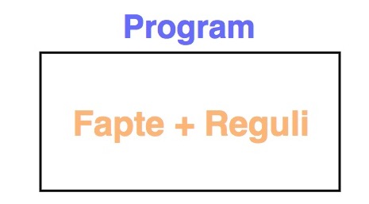
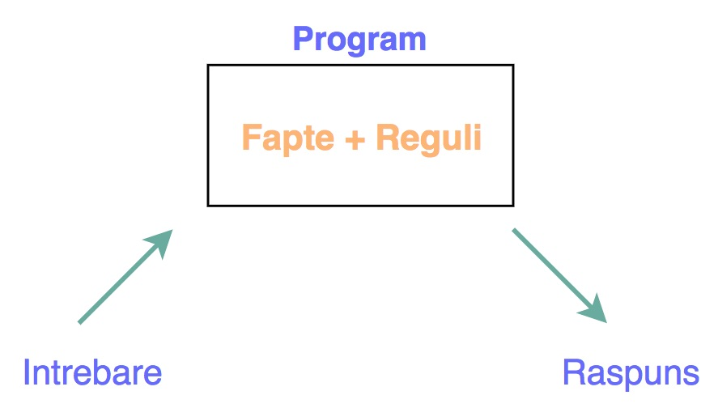
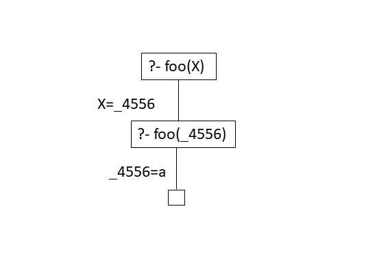
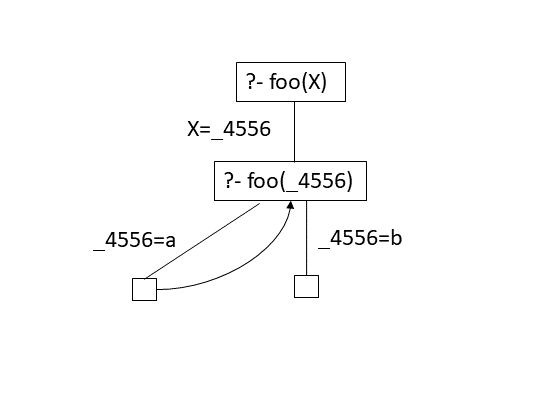
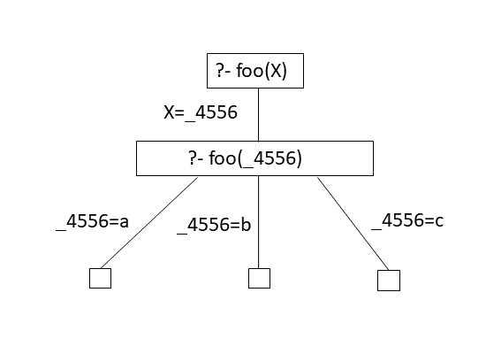
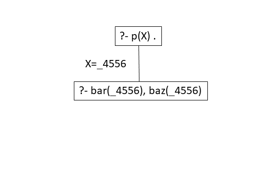

# Programare Logică

## Programare logică

- Programarea logică este o paradigmă de programare bazată pe logică.

- Unul din sloganurile programării logice:

  ::: center
  [ **Program = Logică +
  Control**](https://www.doc.ic.ac.uk/~rak/papers/History.pdf)
  :::

- Programarea logică poate fi privită ca o deducție controlată.

- Un program scris într-un limbaj de programare logică este

  - o listă de formule într-o logică

  - ce exprimă fapte și reguli despre o problemă.

## Programare logică

Exemple de limbaje de programare logică:

-    Prolog

-    Answer set programming (ASP)

-    Datalog

## Programare logică - în mod idealist

-   Un "program logic" este o colecție de proprietăți presupuse (sub
    formă de formule logice) despre lumea programului.

-   Programatorul furnizează și o proprietate (o formula logică) care
    poate să fie sau nu adevărată în lumea respectivă (întrebare,
    query).

-   Sistemul determină dacă proprietatea aflată sub semnul întrebării
    este o consecință a proprietăților presupuse în program.

-   Programatorul nu specifică metoda prin care sistemul verifică dacă
    întrebarea este sau nu consecință a programului.

## Exemplu de program logic

::: center
  ------------------------- ------- ------------------
                     `oslo`  $\to$  `windy`
                     `oslo`  $\to$  `norway`
                   `norway`  $\to$  `cold`
    `cold `$\wedge$` windy`  $\to$  `winterIsComing`
                                    `oslo`
  ------------------------- ------- ------------------
:::

**Exemplu de întrebare.** Este adevărat `winterIsComing`?

## Prolog

-   bazat pe logica clauzelor Horn

-   semantica operațională este bazată pe rezoluție

-   este Turing complet

Program:

```prolog
windy :- oslo.
norway :- oslo.
cold :- norway.
winterIsComing :- windy, cold.
oslo.
```

Intrebare:

```prolog
?- winterIsComing.
true
```

[http://swish.swi-prolog.org/](http://swish.swi-prolog.org/)

## Program în Prolog = bază de cunoștințe

**Exemplu.** Un program în Prolog:
```prolog
father(peter,meg).
father(peter,stewie).

mother(lois,meg).
mother(lois,stewie).

griffin(peter).
griffin(lois).

griffin(X) :- father(Y,X),  griffin(Y).
```

Un program în Prolog este o bază de cunoștințe (Knowledge Base).

## Program în Prolog = mulțime de predicate

Practic, gândim un program în Prolog ca o mulțime de predicate cu
ajutorul cărora descriem *lumea* (*universul*) programului respectiv.

**Exemplu.**

::: columns
::: {.column width=.5}
```prolog
father(peter,meg).
father(peter,stewie).

mother(lois,meg).
mother(lois,stewie).

griffin(peter).
griffin(lois).

griffin(X) :- father(Y,X),  griffin(Y).
```
:::

::: {.column width=.3}
**Predicate:**
```prolog
father/2
mother/2
griffin/1
```
:::
:::

## Un program în Prolog

::: center

:::

## Program

-   Un program în Prolog este format din reguli de forma

    ::: center
    ```prolog
    Head :- Body.
    ```
    :::

-    Head este un predicat, iar Body este o secvență de predicate
    separate prin virgulă.

-   Regulile fără `Body` se numesc fapte.

**Exemple.**

-   Exemplu de regulă:

    ```prolog
    griffin(X) :- father(Y,X), griffin(Y).
    ```

-   Exemplu de fapt:

    ```prolog
    father(peter,meg).
    ```

## Interpretarea din punctul de vedere al logicii

Operatorul **:-** este implicația logică $\leftarrow$.

**Exemplu.** `comedy(X) :- griffin(X).`{.prolog}

dacă `griffin(X)`{.prolog} este adevărat, atunci `comedy(X)`{.prolog} este adevărat.

Virgula , este conjuncția $\wedge$.

**Exemplu.** `griffin(X) :- father(Y,X), griffin(Y).`{.prolog}

dacă `father(Y,X)`{.prolog} și `griffin(Y)`{.prolog} sunt adevărate,

atunci `griffin(X)`{.prolog} este adevărat.

## Interpretarea din punctul de vedere al logicii

Mai multe reguli cu același Head reprezintă posibilități de defini același predicat.

**Exemplu.**

```prolog
comedy(X) :- family_guy(X).
comedy(X) :- south_park(X).
comedy(X) :- disenchantment(X).
```

dacă `family_guy(X)`{.prolog} este adevărat sau `south_park(X)`{.prolog} este adevărat sau
`disenchantment(X)`{.prolog} este adevărat,

atunci `comedy(X)`{.prolog} este adevărat.

## Un program în Prolog

::: center


Cum folosim un program în Prolog?
:::

## Întrebări în Prolog

::: center

:::

## Întrebări și ținte în Prolog

-   Prolog poate răspunde la întrebări legate de consecințele relațiilor
    descrise într-un program în Prolog.

- Întrebările sunt de forma:

  ::: center
  `?- predicat`$_1$`(`$\ldots$`),`$\ldots$`,predicat`$_n$`(`$\ldots$`).`
  :::

-   Prolog verifică dacă întrebarea este o consecință a relațiilor
    definite în program.

-   Dacă este cazul, Prolog caută valori pentru variabilele care apar în
    întrebare astfel încât întrebarea să fie o consecință a relațiilor
    din program.

-   Un predicat care este analizat pentru a răspunde la o întrebare se
    numește țintă (goal).

## Întrebări în Prolog

Prolog poate da 2 tipuri de răspunsuri:

-    `false`{.prolog} -- dacă întrebarea nu este o consecință a programului.

-    `true`{.prolog} sau valori pentru variabilele din întrebare dacă întrebarea
    este o consecință a programului.

### Exemplu
::: columns
::: {.column width=.4}
```prolog
?- griffin(meg)
true

?- griffin(glenn)
false
```
:::

::: {.column width=.4}
```prolog
?- griffin(X)
X = petr ;
X = lois ;
X = meg ;
X = stewie ;
false
```
:::
:::

## Cum găsește Prolog răspunsul

Pentru a găsi un răspuns,\
Prolog încearcă regulile în ordinea apariției lor.

**Exemplu.** Să presupunem că avem programul:

```prolog
foo(a).  foo(b).  foo(c).
```

și că punem întrebarea:

```prolog
?- foo(X).
X = a.
```
Pentru a răspunde la întrebare se caută o potrivire (unificator) între
scopul `foo(X)`{.prolog} și baza de cunoștințe. Răspunsul este substituția care
realizează unificarea, în cazul nostru `X = a`{.prolog}.

## Cum găsește Prolog răspunsul

**Exemplu.** Să presupunem că avem programul:

```prolog
foo(a).  foo(b).  foo(c).
```

și că punem întrebările:

```prolog
?- foo(X).
X = a.

?- foo(d).
false
```

Dacă nu se poate face unificarea, răspunsul este `false`{.prolog}.

## Cum găsește Prolog răspunsul

**Exemplu.** Să presupunem că avem programul:

```prolog
foo(a).  foo(b).  foo(c).
```

și că punem întrebarea:
```prolog
?- foo(X).
X = a.
```

Dacă dorim mai multe răspunsuri, tastăm `;`{.prolog}

```prolog
?- foo(X).
X = a ;
X = b ;
X = c.
```

## Cum găsește Prolog răspunsul

**Exemplu.**

::: columns
::: {.column width=.5}
Să presupunem că avem programul:

```prolog
foo(a).
foo(b).
foo(c).
```

și că punem întrebarea:

```prolog
?- foo(X).
```
:::
::: {.column width=.5}


:::
:::

## Cum găsește Prolog răspunsul

Pentru a găsi un raspuns, Prolog redenumește variabilele.

**Exemplu.**

::: columns
::: {.column width=.5}
Să presupunem că avem programul:

```prolog
foo(a).
foo(b).
foo(c).
```

și că punem întrebarea:

```prolog
?- foo(X).
```
:::
::: {.column width=.5}


:::
:::

## Cum găsește Prolog răspunsul

**Exemplu.**

::: columns
:::{.column width=.5}
Să presupunem că avem programul:

```prolog
foo(a).
foo(b).
foo(c).
```

și că punem întrebarea:

```prolog
?- foo(X).
```
:::
::: {.column width=.5}

:::
:::

În acest moment, a fost găsită prima soluție: `X=_4556=a`.

## Cum găsește Prolog răspunsul

**Exemplu.**

::: columns
::: {.column width=.5}
Să presupunem că avem programul:

```prolog
foo(a).
foo(b).
foo(c).
```

și că punem întrebarea:

```prolog
?- foo(X).
```
:::
::: {.column width=.5}

:::
:::

Dacă se dorește încă un răspuns, atunci se face un pas înapoi în
arborele de căutare și se încearcă satisfacerea țintei cu o nouă
valoare.

## Cum găsește Prolog răspunsul

**Exemplu.**

::: columns
::: {.column width=.5}
2 Să presupunem că avem programul:

```prolog
foo(a).
foo(b).
foo(c).
```

și că punem întrebarea:

```prolog
?- foo(X).
```
:::
::: {.column width=.5}

:::
:::

## Cum găsește Prolog răspunsul

**Exemplu.**

::: columns
::: {.column width=.5}
Să presupunem că avem programul:

```prolog
bar(b).
bar(c).
baz(c).
```

și că punem întrebarea:

```prolog
?- bar(X),baz(X).
```

:::
::: {.column width=.5}

:::
:::

## Cum găsește Prolog răspunsul

Prolog se întoarce la ultima alegere dacă o subțintă eșuează.

**Exemplu.**

::: columns
::: {.column width=.5}
Să presupunem că avem programul:

```prolog
bar(b).
bar(c).
baz(c).
```

și că punem întrebarea:

```prolog
?- bar(X),baz(X).
```
:::
::: {.column width=.5}

:::
:::

## Cum găsește Prolog răspunsul

**Exemplu.**

::: columns
::: {.column width=.5}
Să presupunem că avem programul:

```prolog
bar(b).
bar(c).
baz(c).
```

și că punem întrebarea:

```prolog
?- bar(X),baz(X).
```
:::
::: {.column width=.5}

:::
:::

Soluția găsită este: `X=_4556=c`{.prolog}.

## Problema colorării hărților

Să se coloreze o hartă dată cu o mulțime de culori dată astfel încât
oricare două țări vecine să fie colorate diferit.

Cum modelăm această problemă în Prolog?

::: columns
::: {.column width=.5}
Trebuie să definim:

-   culorile

-   harta

-   constrângerile
:::
::: {.column width=.5}
](images/europe1.png)
:::
:::

## Problema colorării hărților

Definim culorile, harta și constrângerile.

```prolog
culoare(albastru).
culoare(rosu).
culoare(verde).
culoare(galben).

harta(RO,SE,MD,UA,BG,HU) :- vecin(RO,SE), vecin(RO,UA),
                            vecin(RO,MD), vecin(RO,BG),
                            vecin(RO,HU), vecin(UA,MD),
                            vecin(BG,SE), vecin(SE,HU).

vecin(X,Y) :- culoare(X), culoare(Y), X \== Y.
```


## Problema colorării hărților

Ce răspuns primim?

```prolog
?- harta(RO,SE,MD,UA,BG,HU).
RO = albastru,
SE = UA, UA = rosu,
MD = BG, BG = HU, HU = verde
```


#  Unificare


## Termeni

### Alfabet:

-   $\mathcal{F}$ o mulțime de simboluri de funcții de aritate cunoscută

-   $\mathcal{V}$ o mulțime numărabilă de variabile

-   $\mathcal{F}$ și $\mathcal{V}$ sunt disjuncte

### Termeni peste $\mathcal{F}$ si $\mathcal{V}$:
$$\begin{aligned}
t \ ::= \ x\ |\ f(t_1,\ldots,t_n)
\end{aligned}$$

-   $n \geq 0$

-   $x$ este o variabilă

-   $f$ este un simbol de funcție de aritate $n$

## Termeni (Notații)

-   $x,y,z,\ldots$ pentru variabile

-   $a,b,c,\ldots$ pentru constante (simboluri de funcții de aritate $0$)

-   $f,g,h,\ldots$ pentru simboluri de funcții arbitrare

-   $s,t,u,\ldots$ pentru termeni

-   $Var(t)$ mulțimea variabilelor care apar în $t$

-   ecuații $s\ueq t$ pentru o pereche de termeni

-   $Trm_{\mathcal{F,\mathcal{V}}}$ mulțimea termenilor peste
    $\mathcal{F}$ și $\mathcal{V}$

## Termeni (Exemple)

- $f(x,g(x,a),y)$ este un termen, unde

  - $f$ are aritate $3$,

  - $g$ are aritate $2$,

  - $a$ este o constanta

- $Var(f(x,g(x,a),y)) = \{x,y\}$


## Substituții

O substituție $\Theta$ este o funcție (parțială) de la variabile la
termeni,
$$\Theta: \mathcal{V} \to Trm_{\mathcal{F,\mathcal{V}}}$$

### Exemplu:

În notația uzuală, $\Theta = \{ a/x,\ g(w)/y, b/z\}$.

Substituția $\Theta$ este identitate pe restul variabilelor.

Notație alternativă
$\Theta = \{x \mapsto a, y \mapsto g(w), z \mapsto b\}$.

## Substituții

- Substituțiile sunt o modalitate de a înlocui variabile cu alți termeni.

- Substituțiile se aplică simultan pe toate variabilele.

- Aplicarea unei substituții $\Theta$ unui termen $t$:

  $$\begin{aligned}
  \Theta(t) =
  \left\{
      \begin{array}{ll}
          \Theta(x), \mbox{ dacă } t = x \\
          f(\Theta(t_1),\ldots,\Theta(t_n)), \mbox{ dacă } t = f(t_1,\ldots,t_n) \\
      \end{array}
  \right.
  \end{aligned}$$

__Exemplu:__

- $\Theta = \{x \mapsto f(x,y), y \mapsto g(a) \}$

- $t = f(x,g(f(x,f(y,z))))$

- $\Theta(t) = f(f(x,y),g(f(f(x,y),f(g(a),z))))$

## Substituții

Două substituții $\Theta_1$ și $\Theta_2$ se pot compune
$${\color{IntensColor} \Theta_1 ; \Theta_2}$$\
(aplicăm întâi $\Theta_1$, apoi $\Theta_2$).

__Exemplu:__

-   ${\color{IntensColor} t = h(u,v,x,y,z)}$

-    $\Theta_1 = \{ x \mapsto f(y),\ y \mapsto f(a),\ z \mapsto u \}$

-    $\Theta_2 = \{y \mapsto g(a),\ u \mapsto z,\ v \mapsto f(f(a))\}$

-   ${\color{IntensColor} (\Theta_1 ; \Theta_2)(t) =}\  {\Theta_2}({\Theta_1}(t)) = {\Theta_2}(h(u, v, f(y), f(a), u)) =$\
    ${\color{IntensColor} = h(z,f(f(a)), f(g(a)), f(a), z)}$

-   ${\color{IntensColor} (\Theta_2 ; \Theta_1)(t) = }\ {\Theta_1}({\Theta_2}(t)) = {\Theta_1}(h(z,f(f(a)),x, g(a), z))$\
    ${\color{IntensColor} = h(u,f(f(a)), f(y), g(a), u)}$

## Unificare

Doi termeni $t_1$ și $t_2$ se unifică dacă există o substituție $\Theta$
astfel încât
$$\Theta(t_1) = \Theta(t_2)$$

În acest caz, $\Theta$ se numește un unificator al termenilor $t_1$ și
$t_2$.

Un unificator $\Theta$ pentru $t_1$ și $t_2$ este cel mai general
unificator (cmgu,mgu) dacă pentru orice alt unificator $\Theta'$ pentru
$t_1$ și $t_2$, există o substituție $\Delta$ astfel încât
$$\Theta' = \Theta ; \Delta$$

## Unificatori (Exemplu)

-   ${\color{IntensColor} t = x + (y * y)} = +(x,*(y,y))$

-   ${\color{IntensColor} t' = x + (y * x)} = +(x,*(y,x))$

-   $\Theta = \{x \mapsto y\}$

    -   $\Theta(t) = y + (y * y)$

    -   $\Theta(t') = y + (y * y)$

    -   $\Theta$ este cmgu

-   $\Theta'= \{x \mapsto 0, y \mapsto 0\}$

    -   $\Theta'(t) = 0 + (0 * 0)$

    -   $\Theta'(t') = 0 + (0 * 0)$

    -   $\Theta' = \Theta ; \{y \mapsto 0\}$

    -   $\Theta'$ este unificator, dar nu este cmgu


#  Algoritmul de unificare

## Algoritmul de unificare

- Pentru o mulțime finită de termeni $\{t_1,\ldots, t_n\}$,
  $n \geq 2$,\
  algoritmul de unificare stabilește dacă există un cmgu.

- Există algoritmi mai eficienți,\
  dar îl alegem pe acesta pentru simplitatea sa.

- Algoritmul lucrează cu două liste:

 - Lista soluție: $S$

 - Lista de rezolvat: $R$

- Inițial:

  -  Lista soluție: $S = \emptyset$

  - Lista de rezolvat:
    $R = \{t_1\ueq t_2, \ldots, t_{n-1}\ueq t_n\}$\
    $\ueq$ este un simbol nou care ne ajută să
    formăm perechi de termeni ("ecuații")


## Algoritmul de unificare

Algoritmul constă în aplicarea nedeterministă a regulilor de mai jos:

SCOATE

: orice ecuație de forma $t\ueq t$ din $R$ este eliminată.

DESCOMPUNE

: orice ecuație de forma
  $f(t_1,\ldots,t_n)\ueq f(t_1',\ldots,t_n')$
  din $R$ este înlocuită cu ecuațiile
  $t_1\ueq t_1', \ldots, t_n\ueq t_n'$.

ORIENTEAZĂ

: o ecuaţie de forma $t=x$ din $R$ cu $x \in V$ şi $t \notin V$ este înlocuită
  cu $x=t$;

REZOLVĂ

: orice ecuație de forma $x\ueq t$ din $R$, unde variabila
  $x$ nu apare în termenul $t$, este mutată sub forma
  $x\ueq t$ în $S$.\
  În toate celelalte ecuații (din $R$ și $S$), $x$ este înlocuit
  cu $t$.

EȘEC (conflict)

: o ecuaţie de forma $f(s_1,\ldots,s_n)\ueq g(t_1,\ldots,t_m)$ din $R$, unde
  $f \neq g$, produce eşec;

EȘEC (ciclu)

: o ecuaţie de forma $x=t$ din $R$ cu $t \neq x$ şi $x \in Var(t)$
  produce eşec;

## Algoritmul de unificare

Algoritmul se termină normal dacă $R = \emptyset$.\
În acest caz, $S$ conține cmgu.

Algoritmul este oprit cu concluzia inexistenței unui unificator dacă
este folosită vreuna din regulile care produce eșec


## Algoritmul de unificare - schemă

::: center
  ------------------------- ------------------------------------ -------------------------------------------------------------------------------------------------------
                               Lista soluție                                                      Lista de rezolvat
                                     S                                                                    R

     Inițial                    $\emptyset$                           $t_1\ueq t_1',\ldots, t_n\ueq t_n'$

     SCOATE                   $\ureg{S}{S}$                                          $\ureg{R', t\ueq t}{R'}$

   DESCOMPUNE                       $\ureg{S}{S}$                     $\ureg{R', f(t_1, \ldots, t_n)\ueq f(t_1', \ldots t_n')}{R', t_1\ueq t_1', \ldots t_n\ueq t_n'}$

    ORIENTEAZĂ                      $\ureg{S}{S}$                               $\ureg{R', t \ueq x}{R', x\ueq t}$ dacă $t$ nu variabliă


     REZOLVĂ                   $\ureg{S}{x\ueq t, S[x := t]}$                  $\ureg{R', x\ueq t}{R'[x := t]}$ dacă $x \not\in Var(t)$


      Final                         $S$                                    $\emptyset$
  ------------------------- ------------------------------------ -----------------------------------------------------------------------------------------------------------
:::

$S[x := t]$: în toate ecuațiile din $S$, $x$ este înlocuit cu $t$

## Exemplu: $\{g(y)\ueq x,\ f(x,h(x),y)\ueq f(g(z),w,z)\}$

::: center
                                     $S$                                                                  $R$
  ------------------------------------------------------------------------- ----------------------------------------------------------------------------------- -------------------
                                                 $\emptyset$                          $g(y)\ueq x,\ f(x,h(x),y)\ueq f(g(z),w,z)$                                  \tiny ORIENTEAZĂ
                                                 $\emptyset$                          ${\color{IntensColor}x\ueq g(y)},\ f(x,h(x),y)\ueq f(g(z),w,z)$             \tiny REZOLVĂ
                            ${\color{IntensColor} x\ueq g(y)}$                 $f({\color{IntensColor} g(y)},h({\color{IntensColor} g(y)}),y)\ueq f(g(z),w,z)$    \tiny DESCOMPUNE
                                       $x\ueq g(y)$                                            $g(y)\ueq g(z),\ h(g(y))\ueq w,\ y\ueq z$                          \tiny ORIENTEAZĂ
                                       $x\ueq g(y)$                                            $g(y)\ueq g(z),\ {\color{IntensColor}w\ueq h(g(y))},\ y\ueq z$     \tiny REZOLVĂ
                          ${\color{IntensColor} w\ueq h(g(y))},$                   $g(y)\ueq g(z),\ y\ueq z$                                                      \tiny REZOLVĂ
                                      $\ x\ueq g(y)$
   ${\color{IntensColor} y\ueq z}, x\ueq g({\color{IntensColor} z}),$              $g({\color{IntensColor} z})\ueq g(z)$                                          \tiny SCOATE
                           $w\ueq h(g({\color{IntensColor} z}))$
   $y\ueq z, x\ueq g(z),$                                                       $\emptyset$
   $w\ueq h(g(z))$
:::
$\Theta = \{y \mapsto z,\ x \mapsto g(z),\ w \mapsto h(g(z)) \}$ este
cmgu.

## Exemplu: $\{g(y)\ueq x,\ f(x,h(y),y)\ueq f(g(z),b,z)\}$


::: center
        $S$                                                    $R$
  --------------- ------------------------------------------------------------------- ------------------------
    $\emptyset$          $g(y)\ueq x,\ f(x,h(y),y)\ueq f(g(z),b,z)$                    \tiny  DESCOMPUNE
    $\emptyset$     $g(y)\ueq x,\ x\ueq g(z),\ {\color{False}h(y)\ueq b},\ y\ueq z$    \tiny  EȘEC (conflict)
:::

-   $h$ și $b$ sunt simboluri de funcții diferite!

-   Nu există unificator pentru acești termeni.

## Exemplu: $\{g(y)\ueq x,\ f(x,h(x),y)\ueq f(y,w,z)\}$

::: center
      $S$                                                   $R$
  -------------- ----------------------------------------------------------------------------------- --------------------
   $\emptyset$    $g(y)\ueq x,\ f(x,h(x),y)\ueq f(y,w,z)$                                             \tiny DESCOMPUNE
   $\emptyset$    $g(y)\ueq x,\ x \ueq y,\ h(x) \ueq w,\ y\ueq z$                                     \tiny REZOLVĂ
   $x\ueq y$      $g(y)\ueq {\color{IntensColor}y},\ h({\color{IntensColor}y}) \ueq w,\ y\ueq z$      \tiny ORIENTEAZĂ
   $x\ueq y$      ${\color{False}y \ueq g(y)},\ h(y) \ueq w,\ y\ueq z$                                \tiny EȘEC (ciclu)
:::

-   În ecuația ${g(y)\ueq y}$, variabila $y$ apare în
    termenul $g(y)$.

-   Nu există unificator pentru aceste ecuații.
