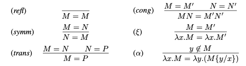
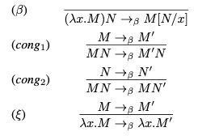

#  Lambda calcul - elemente de bază

## Lambda calcul

- Un model de calculabilitate

- Limbajele de programare funcțională sunt extensii ale sale

- Un limbaj formal

  - Expresiile din acest limbaj se numesc \alert{lambda termeni}

  - Vom defini reguli pentru a îi manipula

## Lambda-termeni: Interpretarea informală

Lambda-termenii au fost gândiţi ca reprezentând
funcţii. Mai exact (fixând $x$, $y$, $z \in V$ distincte două câte
două):

-   Un termen de forma $\lambda x.M$ este gândit ca reprezentând funcţia
    care duce pe $x$ în $M$ ($M$ fiind un termen în a cărui componenţă
    poate sau nu să apară variabila $x$).\
    De exemplu: $\lambda x.x$ ar reprezenta funcţia identitate,
    $\lambda x.y$ ar reprezenta o funcţie constant egală cu $y$.
-   Un termen de forma $MN$ reprezintă rezultatul aplicării „funcţiei”
    $M$ pe „argumentul” $N$.\
    De exemplu: am vrea ca $(\lambda x.x)z$ să reprezinte $z$, iar
    $(\lambda x.y)z$ să reprezinte $y$.

Remarcăm că aceste interpretări sunt aici pur informale: a le face
riguroase a fost mult timp o problemă aproape insurmontabilă. Situaţia
devine mai uşoară dacă nu ne propunem să formalizăm termenii ca funcţii
(semantică denotaţională), ci doar să stabilim regulile prin care ei
sunt manipulaţi (semantică operaţională).

## Lambda termeni: Descrierea formală

Fie $V$ o mulțime infinită de variabile, notate $x,y,z,\dots$.

Mulțimea lambda termenilor este dată de următoarea formă BNF:

::: center
  ---------------- ---- ----------------
     lambda termen  =   variabilă
                    \|  aplicare
                    \|  abstractizare
  ---------------- ---- ----------------

\alert{$M,N ::= x\ |\ (M\, N)\ |\ (\lambda x.\,M)$}
:::

### Exemple

::::: columns
::: column

-   $x, y, z$

-   $(x\, y), (y\, x)$, $(x\, (yx\, ))$

-   $(\lambda x.\,x), (\lambda x.\,(x\, y)), (\lambda z.\,(x\, y))$
:::

::: column

-   $((\lambda x.\,x)\, y), ((\lambda x.\,(x\, z))\, y)$

-   $(\lambda f.\,(\lambda x.\,(f\, (f\, x))))$

-   $((\lambda x.\,x)\, (\lambda x.\,x))$
:::
:::::

## Funcții anonime în Haskell

::: center
  ---------------- ---- ----------------
     lambda termen  =   variabilă
                    \|  aplicare
                    \|  abstractizare
  ---------------- ---- ----------------

\alert{$M,N ::= x\ |\ (M\, N)\ |\ (\lambda x.\,M)$}
:::

În Haskell, `\` e folosit în locul simbolului $\lambda$ și `->` în locul punctului:

  -------------------- ---------------
   $\lambda x. x * x$   `\x -> x * x`
   $\lambda x. x > 0$   `\x -> x > 0`
  -------------------- ---------------

<!-- ## Lambda termeni - definiție alternativă

Fie $V$ o mulțime infinită de variabile, notate $x,y,z,\dots$.

Fie $A$ un alfabet format din elementele din $V$, și simbolurile
speciale $"("$, $")"$, $"\lambda"$ si $"."$

Fie $A^*$ mulțimea tuturor cuvintelor finite pentru alfabetul $A$.

Mulțimea lambda termenilor ${\color{IntensColor} \Lambda} \subseteq A^*$ este
mulțimea definită de următoarele reguli:

$$\frac{}{x}\mbox{ dacă } x \in V$$

$$\frac{M \qquad N}{(M\, N)}$$

$$\frac{M}{(\lambda x. M)}\mbox{ dacă } x \in V$$
 -->

## Convenții

-   Se elimină parantezele exterioare

-   Aplicarea este asociativă la stânga\

    -    $M\, N\, P$ înseamnă $(M\, N)\, P$\

    -    $f\, x\, y\, z$ înseamnă $((f\, x)\, y)\, z$

-   Corpul abstractizării (partea de după punct) se extinde la dreapta
    cât se poate

    -    $\lambda x.\,M\, N$ înseamnă $\lambda x.\,(M\, N)$, nu
        $(\lambda x.\,M)\, N$

-   Mai mulți $\lambda$ pot fi comprimați

    -    $\lambda xyz.\,M$ este o abreviere pentru
        $\lambda x.\,\lambda y.\,\lambda z.\,M$

Aceste convenții nu afectează definiția lambda termenilor.

## Exerciții

**Exercițiu.** Scrieți termenii de mai jos cu cât mai puține paranteze
și folosind convențiile de mai sus, fără a schimba sensul termenilor:

1.  \alert{$(\lambda x.\,(\lambda y.\,(\lambda z.\,((x\, z)(y\, z)))))$}

2.  \alert{$(((a\, b)\, (c\, d))\, ((e\, f)\, (g\, h)))$}

**Exercițiu.** Adăugați parantezele în termenii de mai jos astfel încât
să nu le schimbați sensul:

1.  \alert{$x\, x\, x\, x$}

2.  \alert{$\lambda x.\,x\, \lambda y.\,y$}

## Variabile libere și variabile legate

- $\lambda \_.\,\_$ se numește operator \alert{de legare} (*binder*)
- $x$ din $\lambda x.\,\_$ se numește variabilă \alert{de legare}
  (*binding*)
- $N$ din $\lambda x.\,N$ se numește \alert{domeniul} (*scope*) de
  legare a lui $x$
- toate aparițiile lui $x$ în $N$ sunt legate
- O apariție care nu este legată se numește \alert{liberă}.
- Un termen fără variable libere se numește \alert{închis}
  (*closed*).
- Un termen închis se mai numește și \alert{combinator}.

De exemplu, în termenul

::: center
$M \equiv (\lambda x.\,xy)\, (\lambda y.\,yz)$
:::

-   $x$ este legată
-   $z$ este liberă
-   $y$ are și o apariție legată, și una liberă
-   mulțimea variabilelor libere ale lui $M$ este $\{y,z\}$

## Variabile libere

Mulțimea \alert{variabilelor libere} dintr-un termen $M$ este notată
$FV(M)$ și este definită formal prin:

::: center
  --------------------- ----- -------------------------
                $FV(x)$  $=$  $\{x\}$
            $FV(M\, N)$  $=$  $FV(M) \cup FV(N)$
    $FV(\lambda x.\,M)$  $=$  $FV(M) \setminus \{x\}$
  --------------------- ----- -------------------------
:::

<!-- Exemplu de definiție recursivă pe termeni. Adică în definiția lui
$FV(M)$ am presupus că am definit deja $FV(N)$ pentru toți subtermenii
lui $M$.

### Exemplu

-   $FV(\lambda x.\,x\, y) = FV(x\, y) \setminus \{x\} = (FV(x)\cup FV(y))\setminus \{x\}$\
    $= (\{x\}\cup \{y\}) \setminus \{x\} = \{y\}$

-   $FV(x\, \lambda x.\,x\, y) = \{x, y\}$
 -->

## Spre substituţie

De exemplu, când spunem că $(\lambda x.x)z$ am vrea să reprezinte $z$,
sugerăm că $x$-ul din corpul „funcţiei” am vrea să fie substituit cu $z$.
Pentru aceasta, avem nevoie de o definiţie a substituţiei. Nu putem
substitui **naiv** variabilele cu $\lambda$-termeni din aceleaşi
considerente ca la logica de ordinul I: am putea să ne trezim cu urmări
nedorite, de exemplu, dacă în $\lambda$-termenul $$\lambda x.y,$$
reprezentând funcţia „constant egală cu $y$”, substituim fără atenţie $y$
cu $x$, ajungem la $\lambda$-termenul $$\lambda x.x,$$ care reprezintă o
funcţie identitate (variabila $x$ fiind capturată „accidental” de către
$\lambda x$). Or, aceasta contravine intuiţiei care ne spune că o
funcţie compusă cu una constantă nu poate fi neconstantă.

## Spre substituţie

Observăm următorul fapt: termeni ca $\lambda x.x$ şi $\lambda z.z$ am
dori să denote aceeaşi funcţie, funcţia identitate; la fel şi
$\lambda x.y$ şi $\lambda z.y$ aceeaşi funcţie, funcţia constant egală
cu $y$. Aşadar, vom transforma întâi $\lambda x.y$ în $$\lambda z.y,$$
pentru a putea substitui apoi $y$ cu $x$, obţinând $$\lambda z.x,$$ care
este tot o funcţie constantă.

Practic, ideea este că denumirile variabilelor legate nu contează, atâta
timp cât ele sunt folosite consecvent: de aceea, ele se pot şi substitui
una cu alta atâta timp cât şi substituţia este consecventă. Dat fiind că
în acest principiu se aminteşte de substituţie, el se va putea formaliza
abia după definirea substituţiei. Totuşi, acea parte a sa care este
relevantă pentru definirea substituţiei poate fi inclusă în definiţie,
folosind recursivitatea.

## Definirea substituţiei

Pentru orice $\lambda$-termeni $M$, $N$ şi orice $x \in V$, vom defini
termenul $M[x:=N]$, reprezentând $M$ în care $x$ a fost înlocuit cu $N$.
O vom face recursiv, în felul următor (unde $x$, $y \in V$, iar $N$, $P$, $Q$ sunt $\lambda$-termeni):

-   $x[x:=N] := N$;

-   $x[y:=N] := x$, dacă $y\neq x$;

-   $(PQ)[x:=N] := (P[x:=N])(Q[x:=N])$;

-   $(\lambda x.P)[x:=N] := \lambda x.P$;

-   $(\lambda y.P)[x:=N] := \lambda y.(P[x:=N])$, dacă $y\neq x$ și
    $y \not\in FV(N)$;

-   $(\lambda y.P)[x:=N] := \lambda z.(P[y:=z][x:=N])$, dacă
    $y\neq x$ și $y \in FV(N)$, unde $z$ este o variabilă „nouă”[^1]

[^1]: variabila de indice minim diferită de $x$ și care nu apare în $N$ sau $P$,
      caz care corespunde fenomenului prezentat mai devreme.

## Exemple

Care sunt următorii $\lambda$-termeni (presupunem $u$, $v$, $w$, $x$,
$y$, $z \in V$, distincte două câte două)?

-   $(\lambda y. (x (\lambda w. ((vw)x))))[ x:=uv]$;

-   $(\lambda y. (x (\lambda x.x)))[x:= \lambda y. (xy)]$;

-   $(y (\lambda v.(xv)) ) [x := \lambda y. (vy)]$;

-   $(\lambda x. (zy))[ x:= uv]$.

## Alpha-echivalenţă

În acest moment, putem formaliza intuiţia de mai devreme legată de
substituţia variabilelor legate. Numim $\alpha$-echivalenţă şi o notăm
cu $\equiv_\alpha$ cea mai mică relaţie de echivalenţă $\equiv$ pe
$\lambda$-termeni care satisface următoarele:

-   pentru orice $x$, $y \in V$ şi orice $\lambda$-termen $M$ cu
    $y\notin FV(M)$, $\lambda x.M \equiv \lambda y. (M[x:=y])$;

-   pentru orice $x \in V$ şi orice $\lambda$-termeni $M$, $N$ cu
    $M \equiv N$, avem $\lambda x. M \equiv \lambda x.N$;

-   pentru orice $\lambda$-termeni $M$, $N$, $P$ cu $M \equiv N$, avem
    $MP \equiv NP$ şi $PM \equiv PN$.
<!--
## Redenumire de variabile

Ce înseamnă să redenumim o variabilă într-un termen?

Dacă $x,y$ sunt variabile și $M$ este un termen, $M\langle y/x\rangle$
este rezultatul obținut după redenumirea lui $x$ cu $y$ în $M$.

::: center
$$\begin{aligned}
x\langle y/x\rangle & \equiv  y,  \\
z\langle y/x\rangle & \equiv  z, \hspace{2.4cm} \mbox{dacă } x \neq z\\
(M\, N)\langle y/x\rangle & \equiv (M\langle y/x\rangle)\, (N\langle y/x\rangle) \\
(\lambda x.\,M)\langle y/x\rangle & \equiv \lambda y.\,(M\langle y/x\rangle) \\
(\lambda z.\,M)\langle y/x\rangle & \equiv \lambda z.\,(M\langle y/x\rangle), \hspace{.6cm} \mbox{dacă } x \neq z\\
\end{aligned}$$
:::

Observați că acest tip de redenumire înlocuiește toate aparițiile lui
$x$ cu $y$, indiferent dacă este liberă, legată, sau de legare.

Se folosește doar în cazuri în care $y$ nu apare deja în $M$.

## $\alpha$-echivalență

Ce înseamnă că doi termeni sunt egali,\
**modulo redenumire de variabile legate**?

Definim \alert{$\alpha$-echivalența} ca fiind cea mai mică relație de
congruență $=_\alpha$ pe mulțimea lambda termenilor, astfel încât pentru
orice termen $M$ și orice variabilă $y$ care nu apare în $M$, avem

::: center
$\lambda x.\,M\ =_\alpha\ \lambda y.\,(M\langle y/x\rangle)$
:::

## $\alpha$-echivalență

$\alpha$-echivalența $=_\alpha$ este cea mai mică relație pe lambda
termeni care satisface regulile:

::: center

:::

\alert{Convenția Barendregt:}\
variabilele legate sunt redenumite pentru a fi distincte.

## Substituții

Vrem să substituim variabile cu lambda termeni.

$M[N/x]$ este rezultatul obținut după înlocuirea lui $x$ cu $N$ în $M$.

Trebuie să fim atenți la următoarele cazuri:

\alert{1. Vrem să înlocuim doar variabile libere.}\
Numele variabilelor legate este considerat imaterial, și nu ar trebui să
afecteze rezultatul substituției.\
De exemplu, $x\, (\lambda xy.\,x)[N/x]$ ar trebui să fie
$N\, (\lambda xy.\,x)$,\
nu $N\, (\lambda xy.\,N)$ sau $N\, (\lambda Ny.\,N)$.

## Substituții

\alert{2. Nu vrem să legăm variabile libere neintenționat.}

De exemplu, fie $M \equiv \lambda x.\,y\, x$ și
$N \equiv \lambda z.\,x\, z$.

Variabila $x$ este legată în $M$ și liberă în $N$.

Ce ar trebui să obținem dacă am substitui $y$ cu $N$ în $M$?\
Naiv, ne-am gândi la

::: center
$M[N/y] = (\lambda x.\,y\, x)[N/y] = \lambda x.\,N\, x = \lambda x.\,(\lambda z.\,x\, z)\, x$.
:::

Totuși, nu este ceea ce am vrea să obținem, deoarece $x$ este liber în
$N$, iar în timpul \"substituției\" a devenit legată.

Trebuie să luăm în calcul că $x$-ul legat din $M$ nu este $x$-ul liber
din $N$,\
și de aceea \alert{redenumim variabilele legate} înainte de
substituție.

::: center
$M[N/y] = (\lambda x'.\,y\, x')[N/y] = \lambda x'.\,N\, x' = \lambda x'.\,(\lambda z.\,x\, z)\, x'$.
:::

## Substituții

\alert{Substituția} aparițiilor libere ale lui $x$ cu $N$ în $M$,
notată cu $M[N/x]$,\
este definită prin:

  ------------------------ ---------- -------------------------------------------- --------------------------------------
  $x[N/x]$                  $\equiv$  $N$
  $y[N/x]$                  $\equiv$  y                                            dacă $x \neq y$
  $(M\, P)[N/x]$            $\equiv$  $(M[N/x])\, (P[N/x])$
  $(\lambda x.\,M)[N/x]$    $\equiv$  $\lambda x.\,M$
  $(\lambda y.\,M)[N/x]$    $\equiv$  $\lambda y.\,(M[N/x])$                       dacă $x \neq y$ și $y \not\in FV(N)$
  $(\lambda y.\,M)[N/x]$    $\equiv$  $\lambda y'.\,(M\langle y'/y\rangle[N/x])$   dacă $x \neq y$, $y \in FV(N)$
                                                                                   și $y'$ variabilă nouă
  ------------------------ ---------- -------------------------------------------- --------------------------------------

Deaorece nu specificăm ce variabilă nouă alegem,\
spunem că substituția este bine-definită modulo $\alpha$-echivalențe.

## Exerciții

Calculați următoarele substituții:

1.  \alert{$(\lambda z.\,x)[y/x]$}

2.  \alert{$(\lambda y.\,x)[y/x]$}

3.  \alert{$(\lambda y.\,x)[(\lambda z.\,z\, w)/x]$}
 -->

#  Lambda calcul - $\beta$-reducții

## Spre reducţie

Am spus mai devreme că $(\lambda x.x)z$ am vrea să reprezinte $z$, iar
pentru aceasta am introdus o definiţie a substituţiei astfel încât
$x[x:=z]=z$. Totuşi, mai trebuie să spunem şi de ce putem face trecerea
$$(\lambda x.x)z \to x[x:=z]$$ sau, în celălalt exemplu,
$$(\lambda x.y)z \to y[x:=z]$$ şi, în general,
$$(\lambda x.M)N \to M[x:=N].$$

Pentru aceasta, vom introduce o nouă relaţie pe $\lambda$-termeni, care
va reprezenta această procedură de reducţie.

## Beta-reducţie

Numim $\beta$-reducţie şi o notăm cu $\to_\beta$ cea mai mică relaţie
$\to$ pe $\lambda$-termeni care satisface următoarele, pentru orice
$\lambda$-termeni $M$, $N$, $P$ şi orice $x \in V$:

-   $(\lambda x.M)N \to M[x:=N]$;

-   dacă $M \to N$, atunci $\lambda x.M \to \lambda x.N$, $MP \to NP$ şi
    $PM \to PN$.

Notăm cu $\to^*_\beta$ închiderea reflexiv-tranzitivă a lui
$\to_\beta$.

Un $\lambda$-termen $M$ se numeşte **formă normală** dacă nu există $N$
cu $M \to_\beta N$. Dacă $M$ şi $N$ sunt $\lambda$-termeni, $N$ se
numeşte **formă normală a lui $M$** dacă $M \to^*_\beta N$ şi $N$ este
formă normală.

<!-- ## $\beta$-reducții

\alert{Convenție.} Spunem că doi termeni sunt egali, notat $M = N$,\
dacă sunt $\alpha$-echivalenți.

-   \alert{$\beta$-reducție} = procesul de a evalua lambda termeni
    prin \"pasarea de argumente funcțiilor\"

-   \alert{$\beta$-redex} = un termen de forma $(\lambda x.\,M)\, N$

-   \alert{redusul} unui redex $(\lambda x.\,M)\, N$ este $M[N/x]$

-   reducem lambda termeni prin găsirea unui subtermen care este redex,
    și apoi înlocuirea acelui redex cu redusul său

-   repetăm acest proces de câte ori putem, până nu mai sunt redex-uri

-   \alert{formă normală} = un lambda termen fără redex-uri

## $\beta$-reducții

Un pas de $\beta$-reducție $\rightarrow_\beta$ este cea mai mică relație
pe lambda termeni care satisface regulile:

::: center

::: -->

## $\beta$-reducții

La fiecare pas, subliniem redexul ales în procesul de $\beta$-reducție.

::: center
  ------------------------------------------------------------------------- --------------------- ---------------------------------------------------------------------
    $(\lambda x.\,y)\, (\underline{(\lambda z.\,zz\, )\, (\lambda w.\,w)})$  $\rightarrow_\beta$  $(\lambda x.\,y)\, ( (z\, z)[z := \lambda w.\,w] )$
                                                                                  $\equiv$        $(\lambda x.\,y)\, ( (z[z := \lambda w.\,w])\, (z[z := \lambda w.\,w] )$
                                                                                  $\equiv$        $(\lambda x.\,y)\, (\underline{(\lambda w.\,w)\, (\lambda w.\,w)})$
                                                                             $\rightarrow_\beta$  $\underline{(\lambda x.\,y)\, (\lambda w.\,w)}$
                                                                             $\rightarrow_\beta$  $y$
  ------------------------------------------------------------------------- --------------------- ---------------------------------------------------------------------
:::

Ultimul termen nu mai are redex-uri, deci este în formă normală.

## $\beta$-reducții

::: center
  ------------------------------------------------------------------------- --------------------- ---------------------------------------------------------------------
    $(\lambda x.\,y)\, (\underline{(\lambda z.\,zz\, )\, (\lambda w.\,w)})$  $\rightarrow_\beta$  $(\lambda x.\,y)\, (\underline{(\lambda w.\,w)\, (\lambda w.\,w)})$
                                                                             $\rightarrow_\beta$  $\underline{(\lambda x.\,y)\, (\lambda w.\,w)}$
                                                                             $\rightarrow_\beta$  $y$
  ------------------------------------------------------------------------- --------------------- ---------------------------------------------------------------------
:::

::: center
  ------------------------------------------------------------------------- --------------------- ----------------------------------------------
    $\underline{(\lambda x.\,y)\, ((\lambda z.\,zz\, )\, (\lambda w.\,w))}$  $\rightarrow_\beta$  $y[x := (\lambda z.\,zz\, )\, (\lambda w.\,w)]$
                                                                                  $\equiv$        $y$
  ------------------------------------------------------------------------- --------------------- ----------------------------------------------
:::

Observăm că:

-   reducerea unui redex poate crea noi redex-uri

-   reducerea unui redex poate șterge alte redex-uri

-   numărul de pași necesari până a atinge o formă normală poate varia,
    în funcție de ordinea în care sunt reduse redex-urile

-   rezultatul final pare că nu a depins de alegerea redex-urilor

## $\beta$-formă normală

Totuși, există lambda termeni care nu pot fi reduși la o $\beta$-formă
normală (evaluarea nu se termină).

::: center
  --------------------------------------------------------- --------------------- ---------------------------------------------
    $\underline{(\lambda x.\,x\, x)\, (\lambda x.\,x\, x)}$  $\rightarrow_\beta$  $(\lambda x.\,x\, x)\, (\lambda x.\,x\, x)$
                                                             $\rightarrow_\beta$  $\ldots$
  --------------------------------------------------------- --------------------- ---------------------------------------------
:::

Observați că lungimea unui termen nu trebuie să scadă în procesul de
$\beta$-reducție; poate crește sau rămâne neschimbată.

## $\beta$-formă normală

Există lambda termeni care deși pot fi reduși la o formă normală, pot să
nu o atingă niciodată.

::: center
  ------------------------------------------------------------------------------------------------ --------------------- ------------------------------------------------------------------------------------
    $\underline{(\lambda xy.\,y)\, ((\lambda x.\,x\, x)\, (\lambda x.\,x\, x))}\, (\lambda z.\,z)$  $\rightarrow_\beta$  $\underline{(\lambda y.\,y)\, (\lambda x.\,x)}$
                                                                                                    $\rightarrow_\beta$  $\lambda x.\,x$
    $(\lambda xy.\,y)\, (\underline{(\lambda x.\,x\, x)\, (\lambda x.\,x\, x))}\, (\lambda z.\,z)$  $\rightarrow_\beta$  $(\lambda xy.\,y)\, ((\lambda x.\,x\, x)\, (\lambda x.\,x\, x))\, (\lambda z.\,z)$
  ------------------------------------------------------------------------------------------------ --------------------- ------------------------------------------------------------------------------------
:::

Contează \alert{strategia de evaluare.}

## $\beta$-formă normală

Notăm cu $M \to^*_\beta M'$ faptul că $M$ poate fi
$\beta$-redus până la $M'$ în $0$ sau mai mulți pași (închiderea
reflexivă și tranzitivă a relației $\rightarrow_\beta$).

$M$ este slab normalizabil *(weakly normalising)* dacă există $N$ în
formă normală astfel încât $M \to^*_\beta N$.

$M$ este puternic normalizabil *(strong normalising)* dacă nu există
reduceri infinite care încep din $M$.

Orice termen puternic normalizabil este și slab normalizabil.

### Exemplu

$(\lambda x.\,y)\, ((\lambda z.\,zz\, )\, (\lambda w.\,w))$ este
puternic normalizabil.

$(\lambda xy.\,y)\, ((\lambda x.\,x\, x)\, (\lambda x.\,x\, x))\, (\lambda z.\,z)$
este slab normalizabil,\
dar nu puternic normalizabil.

## Confluența $\beta$-reducției

\alert{Teorema Church-Rosser.} Dacă $a \to^*_\beta b$
și $a \to^*_\beta c$ atunci există $d$ astfel încât
$b \to^*_\beta d$ și $c\to^*_\beta d$.

{ width=20% }

\alert{Consecință.} Un lambda termen are cel mult o $\beta$-formă
normală (modulo $\alpha$-echivalență).

**Exercițiu.** Pot fi termenii de mai jos aduși la o
$\beta$-formă normală?

1.  \alert{$(\lambda x.\,x)\, M$}
2.  \alert{$(\lambda xy.\,x)\, M\, N$}
3.  \alert{$(\lambda x.\,x\, x)\, (\lambda y.\,y\, y\, y)$}

#  Strategii de evaluare

## Strategii de evaluare

De cele mai multe ori, există mai mulți pași de $\beta$-reducție care
pot fi aplicați unui termen. Cum alegem ordinea? Contează ordinea?

O \alert{strategie de evaluare} ne spune în ce ordine să facem pașii
de reducție.

Lambda calculul nu specifică o strategie de evaluare, fiind
\alert{nedeterminist}. O strategie de evaluare este necesară în
limbaje de programare reale pentru a rezolva nedeterminismul.

## Strategia normală (normal order)

Strategia normală = *leftmost-outermost*\
(alegem redex-ul cel mai din stânga și apoi cel mai din exterior)

-   dacă $M_1$ și $M_2$ sunt redex-uri și $M_1$ este un subtermen al lui
    $M_2$, atunci $M_1$ nu va fi următorul redex ales

-   printre redex-urile care nu sunt subtermeni ai altor redex-uri (și
    sunt incomparabili față de relația de subtermen), îl alegem pe cel
    mai din stânga.

\alert{Dacă un termen are o formă normală, atunci strategia normală va converge la ea.}

::: center
  ------------------------------------------------------------------------------------------------ --------------------- -------------------------------------------------
    $\underline{(\lambda xy.\,y)\, ((\lambda x.\,x\, x)\, (\lambda x.\,x\, x))}\, (\lambda z.\,z)$  $\rightarrow_\beta$  $\underline{(\lambda y.\,y)\, (\lambda x.\,x)}$
                                                                                                    $\rightarrow_\beta$  $\lambda x.\,x$
  ------------------------------------------------------------------------------------------------ --------------------- -------------------------------------------------
:::

## Strategia aplicativă (applicative order)

Strategia aplicativă = *leftmost-innermost*\
(alegem redex-ul cel mai din stânga și apoi cel mai din interior)

-   dacă $M_1$ și $M_2$ sunt redex-uri și $M_1$ este un subtermen al lui
    $M_2$, atunci $M_2$ nu va fi următorul redex ales

-   printre redex-urile care nu sunt subtermeni ai altor redex-uri (și
    sunt incomparabili față de relația de subtermen), îl alegem pe cel
    mai din stânga.

    $(\lambda xy.\,y)\, (\underline{(\lambda x.\,x\, x)\, (\lambda x.\,x\, x))}\, (\lambda z.\,z)$  $\rightarrow_\beta$  $(\lambda xy.\,y)\, ((\lambda x.\,x\, x)\, (\lambda x.\,x\, x))\, (\lambda z.\,z)$

## Strategii în programare funcțională

În limbaje de programare funcțională, în general, reducerile din corpul
unei $\lambda$-abstractizări nu sunt efectuate (deși anumite
compilatoare optimizate pot face astfel de reduceri în unele cazuri).

Strategia *call-by-name* (CBN) = strategia normală fără a face reduceri
în corpul unei $\lambda$-abstractizări

Strategia *call-by-value* (CBV) = strategia aplicativă fără a face
reduceri în corpul unei $\lambda$-abstractizări

Majoritatea limbajelor de programare funcțională folosesc CBV, excepție
făcând Haskell.

## CBN vs CBV

O valoare este un $\lambda$-term pentru care nu există $\beta$-reducții
date de strategia de evaluare considerată.

De exemplu, $\lambda x.\,x$ este mereu o valoare, dar
$(\lambda x.\,x)\, 1$ nu este.

Sub CBV, funcțille pot fi apelate doar prin valori (argumentele trebuie
să fie complet evaluate). Astfel, putem face $\beta$-reducția
$(\lambda x.\,M)\, N \to^*_\beta M[x := N]$ doar dacă $N$ este
valoare.

Sub CBN, amânăm evaluarea argumentelor cât mai mult posibil, făcând
reducții de la stânga la dreapta în expresie. Aceasta este strategia
folosită în Haskell.

CBN este o formă de evaluare leneșă *(lazy evaluation)*: argumentele
funcțiilor sunt evaluate doar când sunt necesare.

## CBN vs CBV

### Exemplu

Considerăm $3$ și $succ$ primitive.

Strategia CBV:

::: center
  --------------------------------------------------------- ---------------------------- ---------------------------------------
    $(\lambda x.\,succ\, x)\, ((\lambda y.\,succ\, y)\, 3)$  $\to^*_\beta$                $(\lambda x.\,succ\, x)\, (succ\, 3)$
                                                                   $\rightarrow$          $(\lambda x.\,succ\, x)\, 4$
                                                             $\to^*_\beta$                $succ\, 4$
                                                                   $\rightarrow$          $5$
  --------------------------------------------------------- ---------------------------- ---------------------------------------
:::

Strategia CBN:

::: center
  --------------------------------------------------------- ---------------------------- ---------------------------------------
   $(\lambda x.\,succ\, x)\, ((\lambda y.\,succ\, y)\, 3)$   $\to^*_\beta$                $succ\, ((\lambda y.\,succ\, y)\, 3)$
                                                             $\to^*_\beta$                $succ\, (succ\, 3)$
                                                                   $\rightarrow$          $succ\, 4$
                                                                   $\rightarrow$          $5$
  --------------------------------------------------------- ---------------------------- ---------------------------------------
:::
