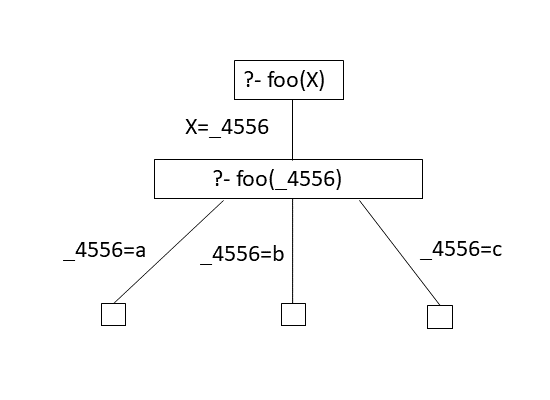

---
author:
- |
  Traian-Florin Șerbănuță\
  Andrei Sipoș
subtitle: C09
title: \[
---

::: frame
:::

# Programare logică & Prolog

::: frame
Programare logică

Programarea logică este o paradigmă de programare bazată pe logică.

Unul din sloganurile programării logice:

::: center
[ **Program = Logică +
Control**](https://www.doc.ic.ac.uk/~rak/papers/History.pdf)
:::

Programarea logică poate fi privită ca o deducție controlată.

Un program scris într-un limbaj de programare logică este

::: center
o listă de formule într-o logică
:::

ce exprimă fapte și reguli despre o problemă.
:::

::: frame
Programare logică

Exemple de limbaje de programare logică:

-    Prolog

-    Answer set programming (ASP)

-    Datalog
:::

::: frame
Programare logică - în mod idealist

-   Un \"program logic\" este o colecție de proprietăți presupuse (sub
    formă de formule logice) despre lumea programului.

-   Programatorul furnizează și o proprietate (o formula logică) care
    poate să fie sau nu adevărată în lumea respectivă ( întrebare,
    query).

-   Sistemul determină dacă proprietatea aflată sub semnul întrebării
    este o consecință a proprietăților presupuse în program.

-   Programatorul nu specifică metoda prin care sistemul verifică dacă
    întrebarea este sau nu consecință a programului.
:::

::: frame
Exemplu de program logic

::: center
  ------------------------- ------- ------------------
                     `oslo`  $\to$  `windy`
                     `oslo`  $\to$  `norway`
                   `norway`  $\to$  `cold`
    `cold `$\wedge$` windy`  $\to$  `winterIsComing`
                                    `oslo`
  ------------------------- ------- ------------------
:::

**Exemplu de întrebare.** Este adevărat `winterIsComing`?
:::

::: frame
Prolog

-   bazat pe logica clauzelor Horn

-   semantica operațională este bazată pe rezoluție

-   este Turing complet

Program:

`windy``\ `{=latex}`:-``\ `{=latex}`oslo.`\
`norway``\ `{=latex}`:-``\ `{=latex}`oslo.`\
`cold``\ `{=latex}`:-``\ `{=latex}`norway.`\
`winterIsComing``\ `{=latex}`:-``\ `{=latex}`windy,``\ `{=latex}`cold.`\
`oslo.`\

Intrebare:

`?-``\ `{=latex}`winterIsComing.`\
`true`

[<http://swish.swi-prolog.org/>]{.underline}
:::

::: frame
Sintaxă: constante, variabile, termeni compuși

-    Atomi: `brian, ’Brian Griffin’, brian_griffin`

-    Numere: `23, 23.03,-1`

    Atomii și numerele sunt constante.

-    Variabile: `X, Griffin, _family`

-   Termeni compuși: `father(peter, stewie_griffin)`,

    `and(son(stewie,peter), daughter(meg,peter))`

    -   forma generală: atom(termen,$\ldots$, termen)

    -   atom-ul care denumește termenul se numește functor

    -   numărul de argumente se numește aritate
:::

::: frame
Sintaxă Prolog

**Exercițiu.** Care din următoarele șiruri de caractere sunt constante
și care sunt variabile în Prolog?

-   vINCENT

-   Footmassage

-   variable23

-   Variable2000

-   big_kahuna_burger

-   'big kahuna burger'

-   big kahuna burger

-   'Jules'

-   \_Jules

-   '\_Jules'
:::

::: frame
Program în Prolog = bază de cunoștințe

**Exemplu.** Un program în Prolog:

    father(peter,meg). 
    father(peter,stewie).

    mother(lois,meg). 
    mother(lois,stewie).

    griffin(peter).
    griffin(lois).

    griffin(X) :- father(Y,X),  griffin(Y).

Un program în Prolog este o bază de cunoștințe ( Knowledge Base).
:::

::: frame
Program în Prolog = mulțime de predicate

Practic, gândim un program în Prolog ca o mulțime de predicate cu
ajutorul cărora descriem *lumea* (*universul*) programului respectiv.

**Exemplu.**

::: columns
::: column
.5

    father(peter,meg). 
    father(peter,stewie).

    mother(lois,meg). 
    mother(lois,stewie).

    griffin(peter).
    griffin(lois).

    griffin(X) :- father(Y,X),  griffin(Y).
:::

::: column
.3 **Predicate:**\
father/2\
mother/2\
griffin/1
:::
:::
:::

::: frame
Un program în Prolog

::: center

:::
:::

::: frame
Program

-   Un program în Prolog este format din reguli de forma

    ::: center
    Head :- Body.
    :::

-    Head este un predicat, iar Body este o secvență de predicate
    separate prin virgulă.

-   Regulile fără `Body` se numesc fapte.

**Exemple.**

-   Exemplu de regulă:\
    `griffin(X) :- father(Y,X), griffin(Y).`

-   Exemplu de fapt:\
    `father(peter,meg).`
:::

::: frame
Interpretarea din punctul de vedere al logicii

Operatorul **:-** este implicația logică $\leftarrow$.

**Exemplu.** `comedy(X) :- griffin(X).`

dacă `griffin(X)` este adevărat, atunci `comedy(X)` este adevărat.

Virgula , este conjuncția $\wedge$.

**Exemplu.** `griffin(X) :- father(Y,X), griffin(Y).`

dacă `father(Y,X)` și `griffin(Y)` sunt adevărate,

atunci `griffin(X)` este adevărat.
:::

::: frame
Interpretarea din punctul de vedere al logicii

Mai multe reguli cu același Head definesc același predicat, între
definiții fiind un sau logic.

**Exemplu.**

`comedy(X)``\ `{=latex}`:-``\ `{=latex}`family_guy(X).`\
`comedy(X)``\ `{=latex}`:-``\ `{=latex}`south_park(X).`\
`comedy(X)``\ `{=latex}`:-``\ `{=latex}`disenchantment(X).`\

dacă `family_guy(X)` este adevărat sau `south_park(X)` este adevărat sau
`disenchantment(X)` este adevărat,

atunci `comedy(X)` este adevărat.
:::

::: frame
Un program în Prolog

::: center

Cum folosim un program în Prolog?
:::
:::

::: frame
Întrebări în Prolog

::: center

:::
:::

::: frame
Întrebări și ținte în Prolog

-   Prolog poate răspunde la întrebări legate de consecințele relațiilor
    descrise într-un program în Prolog.

-    Întrebările sunt de forma:

    ::: center
    `?- predicat`$_1$`(`$\ldots$`),`$\ldots$`,predicat`$_n$`(`$\ldots$`).`
    :::

-   Prolog verifică dacă întrebarea este o consecință a relațiilor
    definite în program.

-   Dacă este cazul, Prolog caută valori pentru variabilele care apar în
    întrebare astfel încât întrebarea să fie o consecință a relațiilor
    din program.

-   Un predicat care este analizat pentru a răspunde la o întrebare se
    numește țintă ( goal).
:::

::: frame
Întrebări în Prolog

Prolog poate da 2 tipuri de răspunsuri:

-    `false` -- dacă întrebarea nu este o consecință a programului.

-    `true` sau valori pentru variabilele din întrebare dacă întrebarea
    este o consecință a programului.

::: example
::: columns
::: column
.4 `?- griffin(meg)`\
`true`

`?- griffin(glenn)`\
`false`
:::

::: column
.4 `?- griffin(X)`\
`X = petr ;`\
`X = lois ;`\
`X = meg ;`\
`X = stewie ;`\
`false`\
:::
:::
:::
:::

::: frame
Cum găsește Prolog răspunsul

Pentru a găsi un răspuns,\
Prolog încearcă regulile în ordinea apariției lor.

**Exemplu.** Să presupunem că avem programul:

    foo(a).  foo(b).  foo(c).

și că punem întrebarea:\
`?- foo(X).`\
`X = a.`\
Pentru a răspunde la întrebare se caută o potrivire ( unificator) între
scopul `foo(X)` și baza de cunoștințe. Răspunsul este substituția care
realizează unificarea, în cazul nostru `X = a`.

::: center
Răspunsul la întrebare este găsit prin unificare!
:::
:::

::: frame
Cum găsește Prolog răspunsul

**Exemplu.** Să presupunem că avem programul:

    foo(a).  foo(b).  foo(c).

și că punem întrebările:\
`?- foo(X).`\
`X = a.`\

`?- foo(d).`\
`false`\

Dacă nu se poate face unificarea, răspunsul este .
:::

::: frame
Cum găsește Prolog răspunsul

**Exemplu.** Să presupunem că avem programul:

    foo(a).  foo(b).  foo(c).

și că punem întrebarea:\
`?- foo(X).`\
`X = a.`\

Dacă dorim mai multe răspunsuri, tastăm\

`?- foo(X).`\
`X = a ;`\
`X = b ;`\
`X = c.`
:::

::: frame
Cum găsește Prolog răspunsul

**Exemplu.**

::: multicols
2 Să presupunem că avem programul:

    foo(a). 
    foo(b). 
    foo(c).

și că punem întrebarea:\
`?- foo(X).`

{width="40%"}
:::
:::

::: frame
Cum găsește Prolog răspunsul

Pentru a găsi un raspuns, Prolog redenumește variabilele.

**Exemplu.**

::: multicols
2 Să presupunem că avem programul:

    foo(a). 
    foo(b). 
    foo(c).

și că punem întrebarea:\
`?- foo(X).`

{width="40%"}
:::
:::

::: frame
Cum găsește Prolog răspunsul

**Exemplu.**

::: multicols
2 Să presupunem că avem programul:

    foo(a). 
    foo(b). 
    foo(c).

și că punem întrebarea:\
`?- foo(X).`

{width="40%"}
:::

În acest moment, a fost găsită prima soluție: `X=_4556=a`.
:::

::: frame
Cum găsește Prolog răspunsul

**Exemplu.**

::: multicols
2 Să presupunem că avem programul:

    foo(a). 
    foo(b). 
    foo(c).

și că punem următoarea întrebare:\
`?- foo(X).`

{width="40%"}
:::

Dacă se dorește încă un răspuns, atunci se face un pas înapoi în
arborele de căutare și se încearcă satisfacerea țintei cu o nouă
valoare.
:::

::: frame
Cum găsește Prolog răspunsul

**Exemplu.**

::: multicols
2 Să presupunem că avem programul:

    foo(a). 
    foo(b). 
    foo(c).

și că punem întrebarea:\
`?- foo(X).`

<figure>

 arborele de căutare

</figure>
:::
:::

::: frame
Cum găsește Prolog răspunsul

**Exemplu.**

::: multicols
2 Să presupunem că avem programul:

    bar(b). 
    bar(c). 
    baz(c).

și că punem întrebarea:\
`?- bar(X),baz(X).`

{width="40%"}
:::
:::

::: frame
Cum găsește Prolog răspunsul

Prolog se întoarce la ultima alegere dacă o subțintă eșuează.

**Exemplu.**

::: multicols
2 Să presupunem că avem programul:

    bar(b). 
    bar(c). 
    baz(c).

și că punem întrebarea:\
`?- bar(X),baz(X).`

{width="40%"}
:::
:::

::: frame
Cum găsește Prolog răspunsul

**Exemplu.**

::: multicols
2 Să presupunem că avem programul:

    bar(b). 
    bar(c). 
    baz(c).

și că punem întrebarea:\
`?- bar(X),baz(X).`

{width="40%"}
:::

Soluția găsită este: `X=_4556=c`.
:::

::: frame
Cum găsește Prolog răspunsul

Ce se întâmplă dacă schimbăm ordinea regulilor?

**Exemplu.**

Să presupunem că avem programul:

    bar(c). 
    bar(b). 
    baz(c).

și că punem întrebarea:\
`?- bar(X),baz(X).`\
`X = c ;`\
`false`

Vă explicați ce s-a întâmplat? Desenați arborele de căutare!
:::

::: frame
Problema colorării hărților

Să se coloreze o hartă dată cu o mulțime de culori dată astfel încât
oricare două țări vecine să fie colorate diferit.

Cum modelăm această problemă în Prolog?

::: multicols
2

Trebuie să definim:

-   culorile

-   harta

-   constrângerile

<figure>

<a
href="https://www.wolfram.com/mathematica/new-in-10/entity-based-geocomputation/find-the-shortest-route-through-the-worlds-capital.html">
Sursa imaginii</a>

</figure>
:::
:::

::: frame
Problema colorării hărților

Definim culorile, harta și constrângerile.

    culoare(albastru).
    culoare(rosu).
    culoare(verde).
    culoare(galben).

    harta(RO,SE,MD,UA,BG,HU) :- vecin(RO,SE), vecin(RO,UA), 
                                vecin(RO,MD), vecin(RO,BG),                                                   
                                vecin(RO,HU), vecin(UA,MD),
                                vecin(BG,SE), vecin(SE,HU).
                                
    vecin(X,Y) :- culoare(X), culoare(Y), X \== Y.                      
:::

::: frame
Problema colorării hărților

Ce răspuns primim?

`?- harta(RO,SE,MD,UA,BG,HU).`\
`RO = albastru,`\
`SE = UA, UA = rosu,`\
`MD = BG, BG = HU, HU = verde`

------------------------------------------------------------------------
:::

::: frame
Liste în Prolog

-   O listă în Prolog este un șir de elemente, separate prin virgulă,
    între paranteze drepte:

    ::: center
    `[1,cold, parent(jon),[winter,is,coming],X]`
    :::

-   O listă poate conține termeni de orice fel.

-   Ordinea termenilor din listă are importanță:

    `?-``\ `{=latex}`[1,2]``\ `{=latex}`==``\ `{=latex}`[2,1]``\ `{=latex}`.`\
    [`false`]{.alert}

-   Lista vidă se notează \[$\,$\].

-   Simbolul $\mid$ desemnează coada listei:

    `?-``\ `{=latex}`[1,2,3,4,5,6]``\ `{=latex}`=``\ `{=latex}`[X|T].`\
    `X``\ `{=latex}`=``\ `{=latex}`1,``\ `{=latex}`T``\ `{=latex}`=``\ `{=latex}`[2,``\ `{=latex}`3,``\ `{=latex}`4,``\ `{=latex}`5,``\ `{=latex}`6].`\
    `?-``\ `{=latex}`[1,2,3|[4,5,6]]``\ `{=latex}`==``\ `{=latex}`[1,2,3,4,5,6].`\
    `true.`
:::

::: frame
Liste în Prolog

**Exerciții.**

1.  Definiți un predicat care verifică că un termen este lista.

    `is_list([]).`\
    `is_list([_``\ `{=latex}`|``\ `{=latex}`T])``\ `{=latex}`:-``\ `{=latex}`is_list(T).`

2.  Definiți predicate care verifică dacă un termen este primul element,
    ultimul element sau coada unei liste.

    `head([X|_],X).`\
    `last([X],X).`\
    `last([_|T],Y):-``\ `{=latex}`last(T,Y).`\
    `tail([],[]).`\
    `tail([_|T],T).`
:::

::: frame
**Pe data viitoare!**
:::
